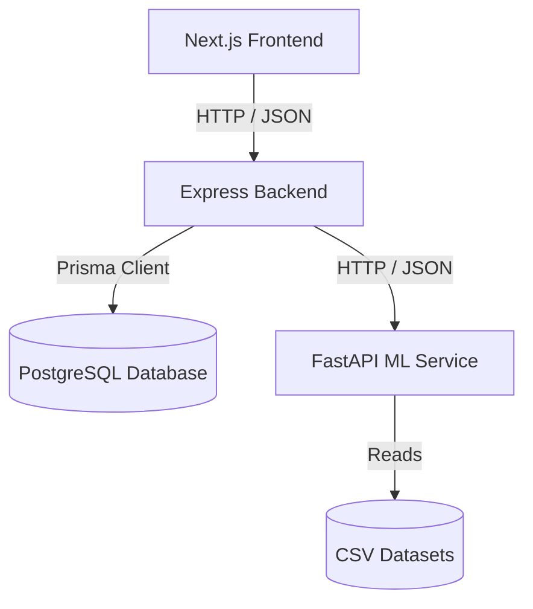

# Implementation Plan — StudentPath AI

StudentPath AI is an AI-powered student opportunity feed, career guidance, skill development, and counselling platform tailored for Indian students. It helps students find personalized opportunities, analyze career compatibility, bridge skill gaps, follow guided roadmaps, and connect with verified professional counsellors.

---

## 1. System Architecture

The platform is designed as a modular monorepo:



- **Frontend**: Next.js 14+ (App Router), TypeScript, Tailwind CSS, Lucide Icons, React Query, and Zustand.
- **Backend**: Node.js, Express, TypeScript, JWT auth, and Prisma ORM.
- **ML Service**: Python, FastAPI, scikit-learn, and pandas for recommendation models, skill gaps, and roadmaps.
- **Database**: PostgreSQL 17.10 (already running on port 5432).

---

## 2. User Review Required

> [!IMPORTANT]
> - **PostgreSQL Configuration**: The local Postgres service requires a password. We will create a `.env` file at the root of `backend/` and `scripts/` with `DATABASE_URL="postgresql://postgres:<PASSWORD>@localhost:5432/studentpath_db?schema=public"`. You will need to fill in your password in `.env` before we run database migrations and seeding.
> - **Simulated Integrations**: For video counselling, we will build a sleek embedded WebRTC/mock video UI. For premium subscriptions and counselling payments, we will create a simulated checkout overlay (payment gateway) that triggers state transitions (e.g. updating student profile to PREMIUM or confirming appointment) without requiring live Stripe keys.

---

## 3. Open Questions

1. **PostgreSQL Password**: What is your local PostgreSQL password for the `postgres` user? If you prefer, we can create the `.env` template with a placeholder, and you can edit it before we run the prisma migration.
2. **ML Models vs NLP Heuristics**: For the opportunity and career recommendations, we will build a combined Rule-based filtering (eligibility checks) + Content-based recommendation (TF-IDF & Cosine Similarity on skills, interests, and backgrounds). Should we also include a pre-trained Random Forest model for profile classification?

---

## 4. Proposed Changes

We will create the following folder structure in the workspace `d:\Student path`:

```
studentpath-ai/
├── datasets/             # CSV files for careers, skills, opportunities, etc.
├── ml-service/           # FastAPI recommendation service
├── backend/              # Node/Express REST API
│   ├── prisma/           # Prisma schema & migrations
│   └── src/              # Express source code
├── frontend/             # Next.js frontend
├── scripts/              # Dataset generation & database seed scripts
├── docker-compose.yml    # Docker configurations (optional for later stages)
└── README.md             # Setup guide
```

### [Component 1] Datasets & Data Pipeline

We will write a dataset generator script in Python to bootstrap the database with realistic demo data, producing:
- [NEW] `datasets/opportunities.csv` (1,000+ active opportunities like scholarships, internships, hackathons, and exams)
- [NEW] `datasets/careers.csv` (100+ careers in India)
- [NEW] `datasets/skills.csv` (300+ skills with categories)
- [NEW] `datasets/career_skills.csv` (mappings with importance)
- [NEW] `datasets/courses.csv` (500+ recommended courses/resources)
- [NEW] `datasets/exams.csv` (100+ Indian competitive exams)
- [NEW] `datasets/scholarships.csv` (200+ Indian scholarships)
- [NEW] `datasets/student_profiles.csv` (5,000+ synthetic student profiles for ML testing)

### [Component 2] Database Schema (Prisma)

We will define the database structure using Prisma ORM.

#### [NEW] [`schema.prisma`](file:///d:/Student%20path/backend/prisma/schema.prisma)
Key schemas include:
- `User` with roles: `STUDENT`, `COUNSELLOR`, `ADMIN`
- `StudentProfile` storing academic stream, branch, CGPA, preferences, and premium status
- `CounsellorProfile` with qualifications, rating, price, availability, and verification documents
- `Opportunity`, `Exam`, `Scholarship`, `Course`, `Career`
- `SavedOpportunity` and `Application` (status: `SAVED`, `PLANNING_TO_APPLY`, `APPLIED`, `SHORTLISTED`, `SELECTED`, `REJECTED`)
- `Roadmap` and `RoadmapStep` for career milestones
- `CounsellingSession`, `CounsellorAvailability`, and `CounsellingReport`
- `Payment`, `Subscription`, `Notification`, and `Message`

### [Component 3] FastAPI ML Service

We will create a Python FastAPI service to run the NLP matching and recommendation algorithms.

#### [NEW] [`ml-service/requirements.txt`](file:///d:/Student%20path/ml-service/requirements.txt)
Includes `fastapi`, `uvicorn`, `scikit-learn`, `pandas`, `numpy`, and `pydantic`.

#### [NEW] [`ml-service/app/main.py`](file:///d:/Student%20path/ml-service/app/main.py)
Implements:
- `/recommend-opportunities` (Content-based filtering + rule checks)
- `/career-recommendation` (Cosine similarity of TF-IDF vectors of profile vs careers)
- `/skill-gap` (Comparing user skills to career skill mappings)
- `/career-roadmap` (Generating ordered roadmap steps based on career requirements)
- `/student-profile-analysis` (Career readiness scoring & diagnostics)

### [Component 4] Express Backend

We will build an Express API with TypeScript, incorporating token-based authentication (JWT) and role-based permissions.

#### [NEW] [`backend/package.json`](file:///d:/Student%20path/backend/package.json)
Configures TypeScript, Prisma Client, and Express packages.

#### [NEW] [`backend/src/app.ts`](file:///d:/Student%20path/backend/src/app.ts)
Main Express application setup.

#### [NEW] [`backend/src/routes/`](file:///d:/Student%20path/backend/src/routes/)
Implements API routers:
- `/api/auth` (Register, Login, Onboarding)
- `/api/students` (Profile management, dashboards, readiness score)
- `/api/opportunities` (Search, filter, tracking, saved list)
- `/api/counsellors` (Registration, profiles, bookings, availability)
- `/api/ai` (Handoff to ML service: recommendations, chat, skill gaps, roadmaps)
- `/api/payments` (Simulated checkout, subscription activation)
- `/api/notifications` (System alerts & message triggers)

### [Component 5] Next.js Frontend

We will build the premium EdTech/SaaS interface with a responsive, modern glassmorphism design.

#### [NEW] [`frontend/src/app/layout.tsx`](file:///d:/Student%20path/frontend/src/app/layout.tsx)
Includes clean global layout, Outfit/Inter typography, and theme provider support.

#### [NEW] [`frontend/src/app/page.tsx`](file:///d:/Student%20path/frontend/src/app/page.tsx)
Premium Landing Page with Hero ("Your Future. One Platform."), CTA, Testimonials, and Interactive feature previews.

#### [NEW] Onboarding & Student Dashboard
- `/onboarding` (Visual step-by-step forms for education, skills, interests, and goals)
- `/dashboard` (Interactive dashboard with Career Readiness radial progress, matching opportunities, deadlines, skill gaps, and active roadmap)

#### [NEW] Portals
- **Opportunity Hub** (`/opportunities`, `/opportunities/[id]`) with Category buttons and filter options
- **AI Career Guidance** (`/career-guidance` and `/career-assessment` wizard)
- **Counsellor Portal** (`/counsellor/dashboard`, `/counsellor/students`, `/counsellor/availability`)
- **Admin Portal** (`/admin`, `/admin/counsellors`, `/admin/opportunities`)

---

## 5. Development Phases

We will build the application in modular, testable phases:

| Phase | Title | Scope |
|---|---|---|
| **Phase 1** | Datasets & Schema | Write generation scripts for datasets; define Prisma schema and run migrations. |
| **Phase 2** | Auth & Onboarding | Backend Express auth endpoints + Frontend Next.js register/login & multi-step onboarding. |
| **Phase 3** | ML Service Setup | Build FastAPI service with Jaccard & TF-IDF similarity algorithms. |
| **Phase 4** | Dashboard & Feed | Integrate opportunity listings with filters, search, and ML recommendation feed. |
| **Phase 5** | AI Guidance & Roadmaps | Implement Career Assessment wizard, Skill Gap visualization, and Roadmap milestones. |
| **Phase 6** | Counselling Booking | Counsellor profile register/verification flow, calendar availability, and simulated booking. |
| **Phase 7** | Handoff & Session UI | AI -> Counsellor summary generator, Live chat interface, and Mock video session UI. |
| **Phase 8** | Tracker & Reminders | Application tracker cards, deadline reminders, and in-app Notification panels. |
| **Phase 9** | Subscriptions & Admin | simulated billing gateways, Premium tier badges, and Admin verification dashboard. |
| **Phase 10** | Testing & Polish | End-to-end user flow verification, performance tuning, and walkthrough reports. |

---

## 6. Verification Plan

### Automated Verification
- We will execute the Python script to verify the ML service starts up and returns recommendations on mock data.
- We will run the Express server and verify that endpoints (auth, onboarding, opportunities) respond correctly using mock curl tests.
- We will run the Next.js build command (`npm run build`) to ensure TypeScript and linting checks pass.

### Manual Verification
- We will test the Student user journey: onboarding -> dashboard -> assessment -> roadmap -> book counsellor.
- We will verify the Counsellor user journey: dashboard -> availability -> view report -> write report.
- We will verify the Admin user journey: approve counsellor -> view analytics.
